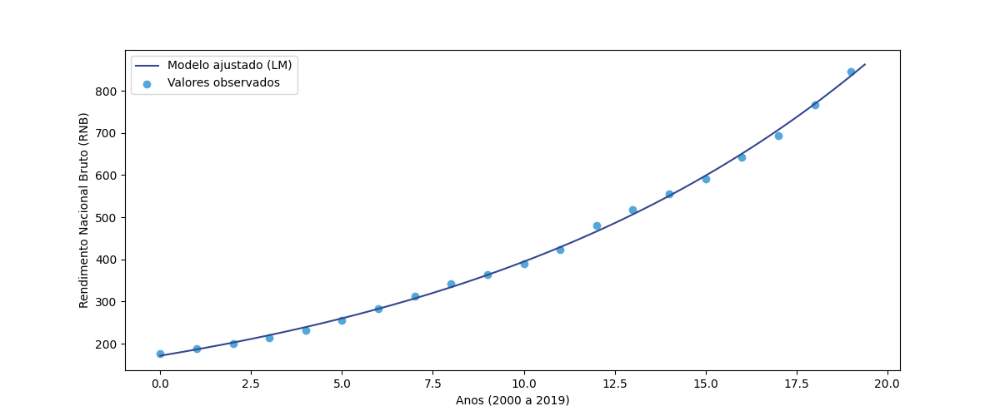
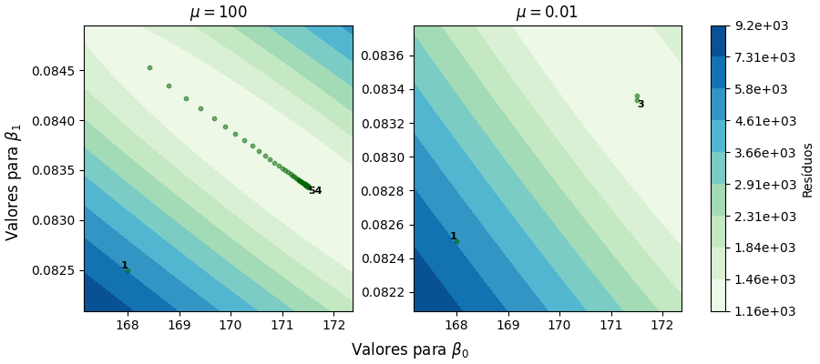

```{r setup, include = FALSE}
# packages
library(dplyr)
library(knitr)
library(xtable)
library(reticulate)
```

```{=tex}
\maketitle
\tableofcontents
\addcontentsline{toc}{section}{Índice}
\clearpage
```

\section{Introdução}

A função exponencial tem uma presença constante na matemática pura e aplicada, levando o famoso matemático W. Rudin a referir que a função exponencial é a “função mais importante da matemática” \cite{WR87}. Esta possui aplicações em áreas como: economia, probabilidades, estatística, biologia, física, medicina, engenharia, entre outras.

$\ $

O crescimento populacional, analisado geralmente através da construção e interpretação de gráficos de dados macroeconómicos, pode ser explicado através das propriedades algébricas e gráficas das funções exponenciais e logarítmicas para o cálculo e interpretação de taxas de crescimento populacional através de séries temporais.

$\ $

O número de Euler é também muito aplicado nas finanças, principalmente em cálculos de juros compostos, onde a riqueza cresce a uma taxa definida ao longo do tempo \cite{WK23}.

$\ $

Um comum problema computacional é o do cálculo da solução para problemas de mínimos quadrados, que possui grande importância numa ampla gama de campos que vão desde a álgebra linear até à econometria e otimização. O grande leque de aplicações em diversas áreas confere à função exponencial um estatuto muito importante no campo matemático pelo que a mesma será utilizada como título exemplificativo para a resolução de sistemas não lineares de equações no presente trabalho. Neste, iremos apresentar algoritmos numericamente estáveis e computacionalmente eficientes para calcular a solução do problema de mínimos quadrados.

$\ $

Dado um conjunto de pontos observados a função exponencial em conjunto com o método dos mínimos quadrados visa encontrar os parâmetros de um determinado modelo matemático de forma a minimizar a soma dos quadrados entre os valores observados e os valores previstos pelo modelo ajustado. 

$\ $

A descoberta do vetor de parâmetros que minimiza a função objetivo pode então ser realizada com recurso a várias técnicas. No presente trabalho serão abordadas duas das mesmas, a decomposição QR e o método de Levenberg-Marquardt. De forma a avaliar e comparar a estabilidade e eficiência dos mesmos, foram analisados conceitos teóricos e resultados numéricos provenientes de algoritmos criados.

$\ $

A decomposição QR foi considerada um dos 10 algoritmos com maior influência no desenvolvimento e na prática da ciência e da engenharia no século XX \cite{BAC00}.

$\ $

Contudo, como parte da revolução industrial, a produção industrial foi otimizada de forma a ser mais inteligente e automatizada. A crescente complexidade da produção industrial aumenta então os requisitos de precisão e velocidade \cite{XHHCBJ23}.

Métodos de resolução de sistemas não lineares como o de Levenberg-Marquardt e evoluções destes são essenciais para assegurar a satisfação da crescente procura por uma otimização mais eficiente.

\newpage
\section{Decomposição QR}

A decomposição QR é utilizada para a resolução de sistemas sobredeterminados, através do método dos mínimos quadrados. Assim sendo, esta pode ser utilizada para a resolução do nosso problema.

A decomposição QR tem como objetivo expressar uma matriz $A\in \mathbb{M}_{m,n} (\mathbb{R})$ no produto de duas matrizes, uma ortogonal $(Q)$ e outra triangular superior $(R)$. Assim, a decomposição de A é tal que:
\begin{equation}
A=QR
\end{equation}
onde $Q\in \mathbb{M}_{m,n} (\mathbb{R})$ é uma matriz cujas colunas formam uma base ortonormada para o espaço das colunas de A (isto é, $Q^T Q = I_n$) e $R\in \mathbb{M}_{n,n} (\mathbb{R})$ é uma matriz invertível, triangular superior com entradas diagonais positivas.

Existem diversos métodos para executar a decomposição QR, sendo um deles o processo de Gram-Schmidt, que constitui uma técnica de ortonormalização. Note-se que para além dessa técnica existem outras mais estáveis numericamente, como é o caso do algoritmo de Householder \cite{GASMK08}.

\subsection{Processo de Ortonormalização de Gram-Schmidt}

A aplicação do processo de ortonormalização de Gram-Schmidt requer a utilização dos vetores que correspondem às colunas da matriz A.
\begin{equation}
A=[a_1|a_2|...|a_n]
\end{equation}
Dois passos essenciais do processo referido são a ortogonalização e a normalização. A realização da ortogonalização tem como intuito a transformação do conjunto de vetores linearmente independentes num conjunto ortogonal, onde cada vetor é ortogonal (perpendicular) aos outros. A normalização transforma este conjunto ortogonal num conjunto ortonormal, isto é, cada vetor possui norma igual a 1.

Então \cite{IY07},
\begin{multline}
\begin{aligned}
& v_1 = a_1, && q_1 = \frac{v_1}{\|v_1\|_2} \\
& v_2 = a_2 - (q_1^T \cdot a_2) q_1, && q_2 = \frac{v_2}{\|v_2\|_2} \\
& v_3 = a_3 - (q_1^T \cdot a_3) q_1 - (q_2^T \cdot a_3) q_2, && q_3 = \frac{v_3}{\|v_3\|_2} \\
& \vdots && \hspace{7.65cm} \\
& v_n = a_n - (q_1^T \cdot a_n) q_1 - \ldots - (q_{n-1}^T \cdot a_n) q_{n-1}, && q_n = \frac{v_n}{\|v_n\|_2}
\end{aligned}
\end{multline}


\subsection{Algoritmo de Gram-Schmidt Clássico}

Note-se que após o processo de ortogonalização e normalização, obtém-se a decomposição QR da matriz A:

\begin{equation}
A = [a_1| a_2|...| a_n] = [q_1| q_2|...| q_n]
\begin{bmatrix}
\|v_1\|_2 & q_1^T\cdot a_2 &...& q_1^T\cdot a_n \\
0 & \|v_2\|_2 &...& q_2^T\cdot a_n \\
\vdots & \vdots & \ddots &\vdots \\
0 & 0 &...& \|v_n\|_2 
\end{bmatrix}
= QR
\end{equation}

\newpage
\subsubsection{Implementação em Python}
As ideias acima apresentadas podem ser sintetizadas através do seguinte algoritmo:

```{python}
import numpy as np

def QRdecomposition_Gram_Schmidt(A):
    """
    entrada:
        A - matriz a decompor
    saída:
        Q - matriz ortogonal
        R - matriz triangular superior
    """
    q = [] #sera a lista de colunas de Q
    R = np.zeros((len(A[0]), len(A[0])), dtype=float) # matriz R, preenchida de zeros

    # percorrer as colunas da matriz A
    for i in range(len(np.transpose(A))):
        ai = np.transpose(A)[i] #ai = coluna i de A

        projecoes = 0 #a subtrair no calculo de vi
        # percorrer as colunas Q ja calculadas
        for n in range(len(q)):
            qn = q[n] #qn = coluna n de Q, ja calculada, pelo que n < i
            R[n][i] = np.inner(qn,ai) #calcular r_{n,i}
            projecoes += R[n][i]*qn #somar as projecoes a subtrair a ai
        
        # calcular vi
        vi = ai - projecoes

        # calcular r_{i,i}: norma 2 de vi
        R[i][i] = np.sqrt(np.inner(vi,vi))

        # calcular qi: normalizacao de vi
        qi = vi/R[i][i]
        q.append(qi)

    # converter q numa matriz (Q') e transpor
    Q = np.transpose(np.vstack(q))

    return Q,R
```

\newpage
\subsection{Regressão Exponencial} \label{exp_aplicado_qr}

Pretende-se utilizar a decomposição QR para estimar os parâmetros que otimizam, no sentido dos mínimos quadrados, uma função exponencial $y(x)$:
\begin{equation}
y(x)=\beta_{0} e^{\beta_{1}x}
\end{equation}

\subsubsection{Linearização do Problema} 

Todavia, a função $y(x)$ não é linear pelo que não é possível obter a matriz $A$, impossibilitando a aplicação da decomposição QR. Por esse motivo, terão que ser realizadas transformações na expressão com o objetivo de linearizar a mesma.

Aplicando logaritmos,
\begin{equation}
ln(y(x))=ln(\beta_{0} e^{\beta_{1}x})
\end{equation}

Através das propriedades dos logaritmos, 
\begin{equation} \label{eq:exp_linearizada}
ln(y(x))=ln(\beta_{0}) + \beta_{1}x
\end{equation}

Assumindo $P(x)=ln(y(x))$, $a_0=ln(\beta_{0})$ e $a_1=\beta_{1}$, tem-se
\begin{equation}
P(x)=a_0 + a_1x
\end{equation}

Uma vez obtida a função $y(x)$ como combinação linear de funções, a fase de linearização
está completa pelo que se pode proceder à aplicação da decomposição QR.

\subsubsection{Resolução do Problema} 

A descoberta dos parâmetros passa pela resolução do sistema $Ax=b$, onde $A$ é a matriz de coeficientes dos parâmetros a estimar do sistema de equações, $x$ é o vetor solução dos parâmetros a estimar e $b$ é o vetor que contém as variáveis resposta do sistema de equações.

Aplicando a decomposição QR à matriz $A$ obtém-se $QR=A$, pelo que podem ser efetuadas as seguintes equivalências matriciais:
\begin{equation}
Ax=b \Leftrightarrow QRx=b \Leftrightarrow Q^TQRx=Q^Tb \Leftrightarrow IRx=Q^Tb \Leftrightarrow Rx=Q^Tb
\end{equation}
Sendo assim, a resolução do sistema de equações $Ax=b$ passa pela resolução do sistema $Rx=Q^Tb$, em que $R$ é a matriz triangular superior proveninente da decomposição QR e $Q^T$ é a transposta da matriz $Q$, também proveniente da decomposição QR, obtendo desta forma, o vetor $x$ dos parâmetros.

Tem-se então:
\begin{equation} \label{eq:exp_qr1}
Ax=b
\quad \Leftrightarrow \quad
\begin{bmatrix}
1 & x_1 \\ 1 & x_2 \\ \vdots & \vdots \\ 1 & x_n
\end{bmatrix}
\begin{bmatrix}
ln(\beta_0) \\ \beta_1
\end{bmatrix}
=
\begin{bmatrix}
ln(y_1) \\ ln(y_2) \\ \vdots \\ ln(y_n)
\end{bmatrix}
\quad \Rightarrow \quad
R
\begin{bmatrix}
ln(\beta_0) \\ \beta_1
\end{bmatrix}
=
Q^T
\begin{bmatrix}
ln(y_1) \\ ln(y_2) \\ \vdots \\ ln(y_n)
\end{bmatrix}
\end{equation}

\subsubsection{Exemplo - Regressão Exponencial: Problema Linearizado (QR)} \label{QR_exemplo}

Considere-se o seguinte exemplo ilustrativo da decomposição QR aplicada a funções exponenciais.

Dado o seguinte conjunto de pontos acerca do Bangladesh \cite{Bang}, país de médio-baixo rendimento, pretende-se analisar o crescimento exponencial do Rendimento Nacional Bruto (RNB) do mesmo de 2000 a 2019. Os valores de $x$ correspondem aos anos e os valores de $y$ ao RNB (em unidades por milhares de milhões de dólares).

\begin{table}[h]
\centering
\begin{tabular}{c|ccccccccccc}
\hline
\textbf{\(x_i\)} & 0 & 1 & 2 & 3 & 4 & 5 & 6 & 7 & 8 & 9 \\
\textbf{\(y_i\)} & 175.5 & 188.1 & 200.2 & 213.7 & 231.6 & 254.7 & 283.1 & 313.5 & 342.9 & 363.7  \\
\hline
\end{tabular}
\end{table}

\begin{table}[h]
\centering
\begin{tabular}{c|ccccccccccc}
\hline
\textbf{\(x_i\)} & 10 & 11 & 12 & 13 & 14 & 15 & 16 & 17 & 18 & 19 \\
\textbf{\(y_i\)} & 389.1 & 422.2 & 481.1 & 518.8 & 555.1 & 591.6 & 643.1 & 693.0  & 767.3 & 846.1 \\
\hline
\end{tabular}
\end{table}

A amostra de dados pode ser explicada pela função $y(x)=\beta_{0} e^{\beta_{1}x}$, pelo que se pretende obter o vetor de parâmetros que minimiza a soma dos quadrados dos resíduos.

Primeiramente, tem que se proceder à linearização da nossa função. Visto que a função $y(x)$ é a mesma que foi utilizada na linearização precedente então obter-se-á a expressão \ref{eq:exp_linearizada}. Uma vez linearizada, os pontos referidos são aplicados à expressão obtida. A dedução do vetor de parâmetros que contém $\beta_{0}$ e $\beta_{1}$ passa pela resolução do sistema sobredeterminado $Ax=b$ (\ref{eq:exp_qr1}), através do seguinte algoritmo elaborado:

```{python}
x = list(range(19 + 1))
y = [np.log(value) for value in [175.5, 188.1, 200.2, 213.7, 231.6, 254.7, 283.1,
                                 313.5, 342.9, 363.7, 389.1, 422.2, 481.1, 518.8,
                                 555.1, 591.6, 643.1, 693.0, 767.3, 846.1]]

# Ax = b; x = [ln(b0), b1]
A = np.column_stack((np.ones(len(x)), x))
b = np.array(y).reshape(-1, 1)
Q, R = QRdecomposition_Gram_Schmidt(A)  # QRx = b
Rx = np.dot(np.transpose(Q), b)  # Rx = Qt*b

x = np.zeros(len(R))
for i in range(len(R) - 1, -1, -1):
    x[i] = (Rx[i, 0] - np.dot(R[i, i + 1:], x[i + 1:])) / R[i, i]

b0, b1 = np.exp(x[0]), x[1]
b0, b1
```

Assim sendo, a função que minimiza os quadrados dos resíduos, de acordo com a decomposição QR, é dada por aproximadamente $y = 171.0\ e^{0.08356x}$.

$\ $

Por último, uma análise visual é sempre importante num problema de regressão, pelo que se torna interessante a apresentação de forma gráfica dos valores observados para a variável explicativa e resposta, provenientes do conjunto de dados fornecido, em conjunto com o modelo estimado.

```{python, include=FALSE}
import graphs as gr

x = list(range(19+1))
y = [175.5, 188.1, 200.2, 213.7, 231.6, 254.7, 283.1, 313.5, 342.9, 363.7, 389.1, 422.2, 481.1, 518.8, 555.1, 591.6, 643.1, 693.0, 767.3, 846.1]
b0,b1 = 171.00724094657875, 0.08356097087277026
col_pontos = (84/255, 168/255, 217/255)
col_linha = (50/255, 71/255, 143/255)

gr.expetativaVSrealidade(x,y,b0,b1,
                      "realidadevsQR.png", 12, 5, "Modelo ajustado (QR)",
                      col_linha, col_pontos)
```

```{r, echo=FALSE, out.width='100%'}

```

Através da análise do gráfico, verifica-se que a linha que representa o modelo ajustado recorrendo à decomposição QR está alinhada com os valores observados, isto é, os valores observados seguem o comportamento da linha ajustada, o que sugere que o modelo capta efetivamente a relação entre as variáveis.

\newpage
\section{Método de Levenberg-Marquardt}

Como referido anteriormente, os problemas de mínimos quadrados surgem no contexto do ajuste de um modelo matemático parametrizado a um conjunto de pontos fornecidos, minimizando uma função objetivo expressa como a soma dos quadrados dos resíduos entre a função do modelo e um conjunto de pontos dados.

$\ $

Dada uma função não linear nos parâmetros, o problema dos mínimos quadrados requer um algoritmo iterativo. Tais algoritmos reduzem a soma dos quadrados dos erros entre a função do modelo e os pontos dados através de uma sequência de atualizações bem escolhidas nos valores dos parâmetros do modelo. Para equações não lineares, pode não haver solução, pode haver um qualquer número de soluções, ou um número infinito de soluções. Ao contrário das equações lineares, é um problema computacional muito difícil determinar qual destes casos é válido para um determinado conjunto de equações. Assim sendo, para problemas não lineares, apenas se pode esperar um algoritmo que encontre uma solução (quando existe) ou produza um valor de $x$ com norma residual que seja a menor possível \cite{SBLV18}.

$\ $

O algoritmo de Levenberg-Marquardt combina dois algoritmos de minimização numérica: o método de declive máximo e o método de Gauss-Newton.
No método de declive máximo, a soma dos erros quadráticos é reduzida pela atualização dos parâmetros na direção de descida mais acentuada. 
No método de Gauss-Newton, a soma dos erros quadráticos é reduzida assumindo que a função de mínimos quadrados é localmente quadrática nos parâmetros e encontrando o mínimo dessa função quadrática. 

$\ $

Desta forma, o nosso problema de regressão exponencial pode também ser resolvido através deste processo, o método de Levenberg-Marquardt. Este não envolve linearização, pelo que pode ser utilizado diretamente em funções não lineares, o que lhe confere uma maior precisão em termos numéricos e robustez para funções não lineares.

$\ $

Por conseguinte, num problema não linear de mínimos quadrados, a função objetivo é a mesma do caso de funções
lineares, e consiste na descoberta do vetor de parâmetros $x$ que minimiza:
\begin{equation} \label{eq:funcao_objetivo}
g(x)=\frac{1}{2}r(x)r(x)^T=\frac{1}{2}\sum_{i=1}^{m}r_i(x)^2
\end{equation}

Apesar de a função objetivo ser igual independentemente da função ser
linear ou não, os resíduos
\begin{equation}
r_i(x)=y_i-f(x), \quad  i=1,...,m
\end{equation}
são não lineares, tal como a função $f(x)$.

Note-se que, o gradiente da função objetivo é dado por
\begin{equation}
\nabla g(x) = \sum_{i=1}^{m}r_i(x) \cdot \nabla r_i(x) = \nabla r(x)^Tr(x)
\end{equation}

onde
\begin{equation}
\nabla r(x)=\begin{bmatrix}
\frac{\partial r_1(x)}{\partial x_1} & \cdots & \frac{\partial r_1(x)}{\partial x_n} \\
\vdots &  & \vdots \\
\frac{\partial r_m(x)}{\partial x_1} & \cdots & \frac{\partial r_m(x)}{\partial x_n}
\end{bmatrix}
\end{equation}
é a matriz $m \times n$ Jacobiana do resíduo $r$ em relação aos parâmetros $x$.

O vetor
\begin{equation}
\nabla r_i(x)=\begin{bmatrix}
\frac{\partial r_i(x)}{\partial x_1} \\
\vdots \\
\frac{\partial r_i(x)}{\partial x_n}
\end{bmatrix}
\end{equation}
corresponde à coluna $i$ da matriz Jacobiana.

Da mesma forma, a segunda derivada de $g(x)$ é dada pela matriz Hessiana
\begin{equation} \label{eq:hessiana}
\begin{split}
\nabla^2 g(x) & =\sum_{i=1}^{m}(\nabla r_i(x) \cdot \nabla r_i(x)^T+r_i(x) \cdot \nabla^2 r_i(x))\\
& =\nabla r(x)^T\nabla r(x) + S(x)
\end{split}
\end{equation}
com $S(x)=\sum_{i=1}^{m}r_i(x) \cdot \nabla^2 r_i(x)$

$\ $

O método de Levenberg-Marquardt sugere a aproximação da matriz $S(x)$ pela matriz diagonal $\mu I$
\begin{equation}
(\nabla r(x^{(k)})^T\nabla r(x^{(k)})+\mu^{(k)}I)s^{(k)}_{LM}=-\nabla r(x^{(k)})^T r(x^{(k)})
\end{equation}

A matriz $\nabla r(x^{(k)})^T\nabla r(x^{(k)})+\mu^{(k)}I$ é simétrica e definida positiva, $n \times n$ (com $n$ igual ao número de parâmetros a estimar). Pode-se portanto, proceder à resolução do sistema de diversas maneiras, como: a decomposição de Cholesky, a decomposição LU, entre outras, encontrando dessa forma $s^{(k)}_{LM}$.

O vetor dos parâmetros $x$ será atualizado mediante cada iteração da seguinte forma \cite{MGDMES11},
\begin{equation}
x^{(k+1)}=x^{(k)}+s^{(k)}_{LM}
\end{equation}

A cada iteração, o valor de $x^{(k+1)}$ estará mais próximo do valor ótimo (aquele que minimiza a soma dos quadrados), pelo que se deve definir uma condição de paragem, podendo esta ser a quantidade de iterações, um valor máximo para a norma do gradiente da função objetivo, $\|\nabla g(x)\|$, ou um valor máximo para o erro, sendo o erro calculado por exemplo por $\|s^{(k+1)}_{LM}\|_{\infty}$. Desta forma, quando é alcançada a precisão desejada o processo iterativo é interrompido, evitando assim iterações desnecessárias e economizando recursos computacionais.

Note-se que o método LM é um método iterativo para otimização não linear, pelo que é imperativo o fornecimento de uma aproximação inicial dos parâmetros do modelo para uma inicialização adequada das iterações do algoritmo.

\newpage
\subsection{Implementação em Python} \label{LM_python}

As ideias acima apresentadas podem ser sintetizadas através do seguinte algoritmo:

```{python}
import numpy as np

def LM_iteration(X, Y, ig, miu):
    """
    entrada:
        X,Y - conjunto de pontos
        ig, miu - aproximacao inicial (b0, b1), parametro mu
    saida:
        b0, b1 - coeficientes atualizados
    """
    matrix_r = np.zeros((len(X), 1))  # matriz dos residuos (R)
    grad_r = np.zeros((len(X), 2))  # gradiente de R

    b0, b1 = ig
    # atualizar matrizes
    for row in range(len(X)):
        matrix_r[row, 0] = Y[row] - b0 * np.exp(b1 * X[row])

        grad_r[row, 0] = -np.exp(b1 * X[row])  # r gradiente: col. 1
        grad_r[row, 1] = -b0 * X[row]* np.exp(b1 * X[row])  # r gradiente: col. 2

    # calcular A(s_LM) = b
    A = np.dot(grad_r.T, grad_r) + np.eye(2) * miu
    b = -np.dot(grad_r.T, matrix_r)

    # resolver s_LM atraves Cholesky
    L = np.linalg.cholesky(A)
    s_LM_y = np.linalg.solve(L, b)
    s_LM = np.linalg.solve(L.T, s_LM_y)

    # atualizar betas
    b0, b1 = float(b0 + s_LM[0]), float(b1 + s_LM[1])

    return b0, b1, s_LM
```

\newpage
\subsubsection{Exemplo - Regressão Exponencial: Problema Não Linear (LM)} \label{LM_exemplo}

Considerando o mesmo conjunto de pontos utilizado na decomposição QR, efetua-se agora uma abordagem diferente do mesmo, recorrendo ao método de Levenberg-Marquardt. 

\begin{table}[h]
\centering
\begin{tabular}{c|ccccccccccc}
\hline
\textbf{\(x_i\)} & 0 & 1 & 2 & 3 & 4 & 5 & 6 & 7 & 8 & 9 \\
\textbf{\(y_i\)} & 175.5 & 188.1 & 200.2 & 213.7 & 231.6 & 254.7 & 283.1 & 313.5 & 342.9 & 363.7  \\
\hline
\end{tabular}
\end{table}

\begin{table}[h]
\centering
\begin{tabular}{c|ccccccccccc}
\hline
\textbf{\(x_i\)} & 10 & 11 & 12 & 13 & 14 & 15 & 16 & 17 & 18 & 19 \\
\textbf{\(y_i\)} & 389.1 & 422.2 & 481.1 & 518.8 & 555.1 & 591.6 & 643.1 & 693.0  & 767.3 & 846.1 \\
\hline
\end{tabular}
\end{table}

O vetor dos parâmetros ótimos será encontrado por aplicação do algoritmo elaborado na secção \ref{LM_python}.

```{python, include = FALSE}
import warnings
warnings.filterwarnings("ignore")
```

```{python}
x = list(range(19 + 1))
y = [175.5, 188.1, 200.2, 213.7, 231.6, 254.7, 283.1, 313.5, 342.9, 363.7, 389.1, 422.2,
    481.1, 518.8, 555.1, 591.6, 643.1, 693.0, 767.3, 846.1]

ig = (170, 0.0836) #obtido atraves do exemplo da seccao 2.3.3
miu = 0.1

iteracoes = 1
while True:
    b0, b1, s_LM = LM_iteration(x, y, ig, miu)

    # condicao de paragem
    if max(abs(s_LM)) < 0.5*10**(-6):
            break
    
    # atualizar parametros
    ig = (b0, b1)
    miu = 0.1
    iteracoes += 1

iteracoes, b0, b1
```

Assim, após o algoritmo de Levenberg-Marquardt realizar 4 iterações, a função que minimiza os quadrados dos resíduos, de acordo com o mesmo, é dada por aproximadamente $y = 171.5\ e^{0.08333x}$.

$\ $

Podemos confirmar este resultado através da aplicação da função \textit{nls}: Nonlinear Least Squares, do R. É necessário indicar o nosso conjunto de pontos e uma aproximação inicial, tal como no método LM, sendo que a única diferença é o parâmetro $\mu$ ter um valor nulo, pelo que o método utilizado por esta função é o método de Gauss-Newton. Ao utilizar-se os mesmos dados definidos acima, tem-se que:

```{r, include=FALSE}
x <- 0:19
y <- c(175.5, 188.1, 200.2, 213.7, 231.6, 254.7, 283.1, 313.5, 342.9, 363.7, 389.1, 422.2, 481.1, 518.8, 555.1, 591.6, 643.1, 693.0, 767.3, 846.1)
```

```{r}
nls(y ~ b0*exp(b1*x), start = list(b0 = 170, b1 = 0.0836))
```

Note-se que os resultados são aproximadamente iguais, mas tendo em conta o número de iterações, a escolha do valor do parâmetro $\mu$ terá sido conservadora, levando a uma otimização mais lenta.

$\ $

Por fim, tal como efetuado para o exemplo relativo à decomposição QR, procede-se à representação gráfica dos valores observados em conjunto com o modelo ótimo estimado.

```{python, include=FALSE}
import graphs as gr

x = list(range(19+1))
y = [175.5, 188.1, 200.2, 213.7, 231.6, 254.7, 283.1, 313.5, 342.9, 363.7, 389.1, 422.2, 481.1, 518.8, 555.1, 591.6, 643.1, 693.0, 767.3, 846.1]
b0,b1 = 171.5072875301047, 0.08333471235500428
col_pontos = (84/255, 168/255, 217/255)
col_linha = (50/255, 71/255, 143/255)

gr.expetativaVSrealidade(x,y,b0,b1,
                      "realidadevsLM.png", 12, 5, "Modelo ajustado (LM)",
                      col_linha, col_pontos)
```

```{r, echo=FALSE, out.width='100%'}

```

Através da análise do gráfico, verifica-se que a linha que representa o modelo ajustado recorrendo ao método de Levenberg-Marquardt está alinhada com os valores observados, isto é, os valores observados seguem o comportamento da linha ajustada, o que sugere que o modelo capta, de facto, a relação entre as variáveis.

\subsection{Escolha da aproximação inicial}

É importante recordar que o método de Levenberg-Marquardt não garante a descoberta do mínimo global. O sucesso da resolução do problema de otimização irá depender da natureza do problema e da qualidade da aproximação inicial escolhida, pelo que se torna essencial uma análise específica do problema.

Ou seja, caso a aproximação inicial esteja muito longe do mínimo global, o algoritmo pode convergir para um mínimo local, uma solução que é ótima dentro de uma determinada vizinhança, mas pode não ser o ótimo global para toda a região de parâmetros \cite{GZDAJC20}. Isto pode ser resolvido através da seleção de uma aproximação inicial próxima da solução esperada, o que muitas vezes implica um conhecimento à priori ou uma análise minuciosa dos dados.

Por isso, a escolha da aproximação inicial é um passo muito importante no método LM, podendo impactar significativamente a convergência e o resultado final da otimização.

Uma boa aproximação inicial fornece ao algoritmo um ponto de partida próximo da solução ótima, permitindo uma convergência mais rápida. Por outro lado, uma aproximação inicial inadequada, que esteja muito longe do mínimo global, leva a uma convergência lenta, aumentando o número de iterações necessárias e a exigência computacional. Para além disso, pode levar o algoritmo a convergir para um mínimo local ou a falhar na convergência.

Apesar de haverem diversos métodos para se obter uma aproximação inicial para o algoritmo, os dois mais comuns são a utilização dos resultados de aproximações lineares, ou seja, aproximar o modelo a um linear e estimar o resultado que minimiza os quadrados dos resíduos, por exemplo através da utilização da decomposição QR (tal como na secção \ref{exp_aplicado_qr}), ou então por tentativa e erro, isto é, executar o algoritmo de otimização várias vezes com diferentes aproximações iniciais aleatórias, explorando diferentes regiões do espaço de parâmetros, e compararando as mesmas, de modo a reduzir o risco de se obter um mínimo local e não global \cite{GZDAJC20}.

\subsection{Escolha do parâmetro $\mu$}

O valor do parâmetro $\mu$, frequentemente chamado de termo de amortecimento, no algoritmo de Levenberg-Marquardt, impacta diretamente o termo $\mu I$, regularizando a matriz Hessiana (\ref{eq:hessiana}) durante a sua inversão, para o cálculo da atualização dos parâmetros do modelo durante a otimização, tornando-a mais estável numericamente \cite{MCYZBXXG17}.

Assim, a seleção apropriada do valor para o parâmetro $\mu$ desempenha um papel crucial no comportamento do algoritmo de Levenberg-Marquardt, pelo que a sua escolha deve ser cuidada.

Caso o valor de $\mu$ seja pequeno ($\mu \rightarrow 0$), o algoritmo de Levenberg-Marquardt assemelha-se ao método de Gauss-Newton \cite{SBLV18}. Nesse cenário, a atualização dos parâmetros tem uma maior ponderação da matriz Jacobiana, tornando o processo de otimização menos cuidadoso, o que resulta numa convergência mais rápida (caracterizada por um menor número de iterações). Esta abordagem é particularmente eficaz quando o modelo é bem comportado e a aproximação inicial está próxima da solução ótima.

Quando o valor de $\mu$ é grande ($\mu \rightarrow \infty$), o comportamento do algoritmo de Levenberg-Marquardt aproxima-se do método de declive máximo \cite{PC07}. Nesse caso, $\mu I$ torna-se dominante na atualização dos parâmetros, o que resulta num processo de otimização mais cuidadoso em que $x^{(k+1)}$ está próximo de $x^{(k)}$, aumentando a estabilidade numérica do algoritmo. Esta abordagem é vantajosa ao lidar com modelos mal comportados.

$\ $

Visualize-se graficamente o impacto da escolha do valor de $\mu$ na resolução do exemplo \ref{LM_exemplo}. Note-se que a aproximação inicial é ($168$, $0.0825$) e o parâmetro $\mu$ irá assumir dois valores: um valor grande ($\mu = 100$) e um valor pequeno ($\mu = 0.01$):

$\ $

```{python, include=FALSE}
import graphs as gr

x = list(range(19 + 1))
y = [175.5, 188.1, 200.2, 213.7, 231.6, 254.7, 283.1, 313.5, 342.9, 363.7, 389.1, 422.2,
    481.1, 518.8, 555.1, 591.6, 643.1, 693.0, 767.3, 846.1]
    
ig = (168,0.0825)
miu = [100, 10**(-2)]
width, height = 9, 4 #image sizes

gr.LM_miu(x, y, ig, miu, width, height)
```

```{r, echo=FALSE, out.width='100%'}

```

Verifica-se que para $\mu=100$ o algoritmo realiza 54 iterações até verificar a condição de paragem de $\|s^{(k)}_{LM}\|_{\infty}<0.5 \times 10^{-3}$, enquanto que com $\mu=0.01$ o mesmo apenas realiza 3 iterações.

$\ $

Pode-se notar então que a escolha do valor para $\mu$ envolve um equilíbrio entre a velocidade de convergência e a estabilidade numérica do algoritmo, pelo que a sua escolha deve ter em conta as características específicas do problema, não sendo escolhido de forma arbitrária.

Existem várias variações do método de Levenberg-Marquardt onde se podem verificar diferentes abordagens para a escolha do parâmetro $\mu$. Algumas publicações indicam que o parâmetro deve ser escolhido pelo utilizador do algoritmo \cite{DM63}, outras indicam que o mesmo deve ser atualizado a cada iteração de acordo com o valor de $\| \nabla r(x^{(k)})' r(x^{(k)}) \|$ \cite{LCYM23}, há quem indique que se deve começar com um valor pequeno para o parâmetro e dividir ou multiplicar por 10 caso a função objetivo melhore ou piore, respetivamente \cite{PC07}, etc.

Contudo, verifica-se que o comum é o valor do parâmetro $\mu$ ser ajustado de acordo com o progresso da otimização, isto é, se a iteração realizada melhorar o valor da função objetivo, o valor de $\mu$ pode ser reduzido para permitir o algoritmo convergir mais rapidamente, caso contrário, o seu valor deve ser aumentado [Nocedal and Wright, 2006].
\textcolor{white}{\cite{JNSW06}}

Assim sendo, o método de Levenberg-Marquardt deve atuar mais como o método de declive máximo quando os parâmetros estão longe do seu valor ótimo, e atuar mais como o método de Gauss-Newton quando os parâmetros estão próximos do mesmo \cite{HPG22}.


\newpage
\section{Conclusão}

A realização deste trabalho permitiu a análise da eficiência e da confiabilidade de duas técnicas fundamentais: a decomposição QR e o método de Levenberg-Marquardt, na estimativa de parâmetros para modelos matemáticos, nomeadamente, modelos exponenciais.

$\ $

Note-se que é de elevada importância relembrar os resultados dos exemplos associados à decomposição QR (secção \ref{QR_exemplo}) e ao método de Levenberg-Marquardt (secção \ref{LM_exemplo}). Enquanto que no exemplo associado à decomposição QR se obteve o vetor de parâmetros ($171.0$, $0.08356$), no exemplo associado ao método LM o vetor de parâmetros obtido foi ($171.5$, $0.08333$). Por isso, devemos analisar o valor ótimo da função objetivo \ref{eq:funcao_objetivo} para cada vetor de parâmetros:

```{python, include=FALSE}
import numpy as np

x = np.array(list(range(19 + 1)))
y = np.array([175.5, 188.1, 200.2, 213.7, 231.6, 254.7, 283.1, 313.5, 342.9, 363.7, 389.1, 422.2,
    481.1, 518.8, 555.1, 591.6, 643.1, 693.0, 767.3, 846.1])
```

```{python}
def funcao_objetivo(y,x,beta):
    r_i = y - beta[0]*np.exp(beta[1]*x)
    valor_otimo = 0.5 * np.sum(r_i**2)
    return valor_otimo

beta_QR, beta_LM = (171.0, 0.08356), (171.5, 0.08333)
funcao_objetivo(y,x,beta_QR), funcao_objetivo(y,x,beta_LM)
```

Verifica-se que o valor ótimo obtido pelos parâmetros associados à decomposição QR é superior ao valor ótimo obtido pelos parâmetros associados método de Levenberg-Marquardt ($582.0 > 579.6$), pelo que o método LM efetuou uma otimização mais precisa face à associada à decomposição QR, dado que é um problema de minimização.

Visto que ambas as técnicas têm em conta o método dos mínimos quadrados, esta diferença nos resíduos estará associada à precisão numérica da técnica, isto é, pelo facto do algoritmo LM ser de aplicação direta, enquanto que para aplicar a decomposição QR, têm de ser realizadas diversas operações para linearizar a função e só depois a aplicação da própria decomposição. Era portanto expectável que a precisão associada à decomposição QR na estimação dos parâmetros fosse menor, devido à propagação do erro.

$\ $

A pesquisa sobre a decomposição QR demonstra a sua eficácia, já conhecida, na resolução de sistemas de equações lineares.
Através da decomposição da matriz dos coeficientes dos parâmetros a estimar numa matriz ortogonal e numa matriz triangular superior, é possível a agilização do processo de descoberta do vetor de parâmetros ótimo. Este processo torna-se particularmente benéfico quando estamos perante sistemas lineares de maior dimensão.

Contudo, considerando modelos exponenciais, pelo facto de ser necessário linearizar o modelo, a decomposição QR é afetada pela propagação do erro, pelo que se pode chegar a um vetor de parâmetros que não corresponde ao ótimo, logo é importante proceder a uma análise crítica dos resultados e considerar métodos de otimização mais avançados. 

$\ $

De qualquer forma, a utilização desta técnica pode ser extremamente útil para se obter uma aproximação inicial para métodos iterativos como é o caso da segunda técnica utilizada, o método LM.

$\ $

Tendo em conta o método de Levenberg-Marquardt, pode-se verificar que este é uma interpolação entre o método de Gauss-Newton e o método de declive máximo, ainda que mais robusto que o primeiro. Percebe-se isto quando, na maioria dos casos, é possível obter uma solução mesmo quando se parte de um ponto muito longe do mínimo ótimo, ainda que mais lentamente que o método de Gauss-Newton. 

Para além disso, ao analisar os resultados do exemplo relativo a este método, verifica-se que os mesmos demonstram a eficácia do método LM em explorar regiões não lineares nos espaços dos parâmetros, convergindo para soluções ótimas, tornando o método uma ferramenta valiosa para a estimação de parâmetros ótimos em modelos não lineares, nomeadamente modelos exponenciais, destacando a sua robustez e adaptabilidade.

```{=tex}
\newpage
\bibliographystyle{apalike}
\bibliography{refs}
\addcontentsline{toc}{section}{Referências}
```
